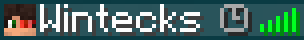
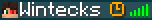
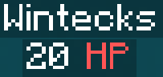
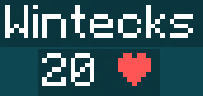

# Better Tab Minecraft Data Pack

### Better Tab is a data pack that adds several chips to a player's nickname on the server tab.

## How to use Better Tab
After you install this data pack on your server and enter the `/reload` command, nothing will happen except for the Reload Done chat notification.
To enable any of the features, you need to write the command `/function mine:options/<name_functional>`. Note that every function that starts with `/function mine:options/` must end with `/on` or `/off`, except for the `off_all` and `on_all` functions, for example `/function mine:options/afk/on`.

**YOU NEED TO ENTER ONE OF THESE COMMANDS, OTHERWISE THE DATA PACKAGE WILL NOT WORK.** If you are not using resource packs specific to this data pack, you need to use this command `/function mine:config/rp_disable`. If you are using any resource pack that changes these icons, you need to use this command `/function mine:config/rp_enable`.

# Functions list

1. `/function mine:options/afk/on` This feature adds a gray icon to the player's nickname if the player has not moved for 8 minutes 
and a gold icon if the player has not moved for more than 30 minutes. 
2. `/function mine:options/hp/on` This function adds the player's health number under their nickname. This function has two display modes that can be changed using the command on
 the label and on the icon. This feature adds a player's health bar under their nickname. Also this feature also has two display modes, which can be changed using the `/function mine:config/hp/no_icon` command to display `HP` and the `/function mine:config/hp/icon` command to display an icon.
 
