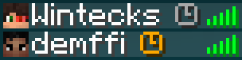
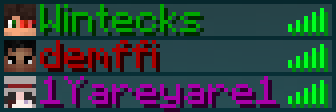
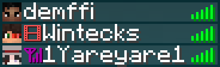

# Better Tab Minecraft Data Pack

### Better Tab is a data pack that adds several chips to a player's nickname on the server tab.

## How to use Better Tab
After you install this data pack on your server and enter the `/reload` command, nothing will happen except for the Reload Done chat notification.
To enable any of the features, you need to write the command `/function mine:options/<name_functional>`. Note that every function that starts with `/function mine:options/` must end with `/on` or `/off`, except for the `off_all` and `on_all` functions, for example `/function mine:options/afk/on`.

**YOU NEED TO ENTER ONE OF THESE COMMANDS, OTHERWISE THE DATA PACKAGE WILL NOT WORK.** If you are not using resource packs specific to this data pack, you need to use this command `/function mine:config/rp_disable`. If you are using any resource pack that changes these icons, you need to use this command `/function mine:config/rp_enable`.

# Functions list

1. `/function mine:options/afk/on` This function adds a gray icon to the player's nickname if the player has not moved for 8 minutes
and a gold icon if the player has not moved for more than 30 minutes. You can also add the afk icon yourself by simply executing the command `/trigger status_afk`

	
3. `/function mine:options/hp/on` This function adds the player's health number under their nickname. This function has two display modes that can be changed using the command on
 the label and on the icon. This feature adds a player's health bar under their nickname. Also this feature also has two display modes, which can be changed using the `/function mine:config/hp/no_icon` command to display `HP` and the `/function mine:config/hp/icon` command to display an icon.

	 

4. `/function mine:options/nwc/on` This function changes the color of the nicknamed player depending on the dimension in which he is located: dark green overworld, dark red The nether, dark purple The end.

	

5. `/function mine:options/status/on` This feature adds a status icon in front of the player's nickname. There are currently two statuses: stream status and recording status. You can assign yourself a status using a command or after logging into a world or server. There are currently three commands: the first command `/trigger status_stream` adds a stream status, the second command `/trigger status_record` adds a record status, and the third command `/trigger status_none` removes the status if it was you
   
	

### I want to note that each function can work with another function, and all these functions can work together.

## Command list
1. `/function mine:config/rp_enable` If you are using a resource pack for this data pack
2. `/function mine:config/rp_disable` if you are not using a resource pack for this dack pack
3. `/trigger status_afk` in order to return to the status of afk
4. `/trigger status_stream` to put it in the status stream
5. `/trigger status_record` to do this, press the record status
6. `/trigger status_none` to remove status
7. `/function mine:options/afk/on` to enable the AFK function
8. `/function mine:options/hp/on` to enable the HP display function
		`/function mine:config/hp/icon` to set a heart icon instead of the HP inscription
		`/function mine:config/hp/no_icon` set HP instead of heart icon
9. `/function mine:options/nwc/on` to enable the function of displaying which dimension the player is in
10. `/function mine:options/status/on` to enable the status feature
